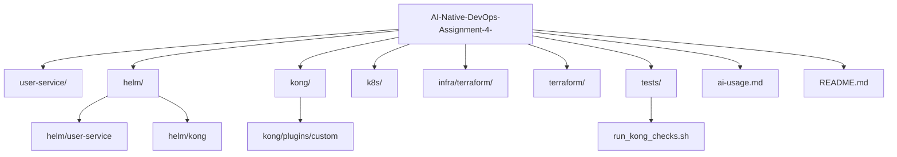

# Secure API Platform using Kong on Kubernetes

This project implements a Kubernetes-based secure API platform with Kong OSS as API Gateway and a FastAPI user microservice.

## High-level Architecture Overview

- Client traffic enters Kong Gateway.
- Kong routes requests to user-service (or WAF proxy path for protected APIs when enabled).
- FastAPI user-service handles authentication and user APIs.
- SQLite is used as a local, file-based database for user records.
- Helm manages service + Kong configuration.
- Terraform provides base Kubernetes infrastructure resources.

## Architecture Flow Diagram

```mermaid
flowchart LR
    C[Client] --> K[Kong Gateway]
    K -->|/health,/verify| US[user-service]
    K -->|/users + plugins| WAF[WAF Proxy (ModSecurity)]
    WAF --> US
    US --> DB[(SQLite)]

    subgraph Kong Plugins on /users
      JWT[JWT Auth]
      RL[Rate Limit 10/min/IP]
      IPW[IP Whitelist]
      LUA[Custom Lua X-Custom-Trace]
    end

    K -. applies .-> JWT
    K -. applies .-> RL
    K -. applies .-> IPW
    K -. applies .-> LUA
```

## API Request Flow (Client → Kong → Microservice)

1. Client sends request to host `user-service.example.com` via Kong proxy.
2. Kong matches Ingress route (`/health`, `/verify`, `/users`).
3. For `/users`, Kong applies plugins: JWT auth, custom trace, rate limiting, IP whitelist.
4. Request is forwarded to backend service (or WAF service when WAF is enabled).
5. Microservice responds; Kong returns response to client with gateway/plugin headers.

## JWT Authentication Flow

1. Client calls `POST /login` directly to user-service and receives JWT.
2. JWT includes issuer key compatible with Kong consumer credential.
3. Client calls protected API `/users` with `Authorization: Bearer <token>`.
4. Kong JWT plugin validates token using externalized secret/credential.
5. If valid, request proceeds to backend; otherwise `401` is returned.

## Authentication Bypass Strategy

- `/health` and `/verify` are exposed through separate Ingress resources without JWT plugin attachment.
- `/users` is routed through Ingress with Kong plugins enabled.
- Result:
  - `/health` and `/verify` are public.
  - `/users` requires valid JWT.

## Security Controls Implemented

- JWT authentication via Kong JWT plugin.
- IP-based rate limiting via Kong rate-limiting plugin (`10/min/IP`).
- IP whitelisting via Kong ip-restriction plugin (CIDRs from Helm values).
- Custom Kong Lua plugin injects `X-Custom-Trace` response header.
- DDoS / attack-layer protection via ModSecurity-based WAF proxy integration.

## DDoS Protection Choice and Integration

### Chosen solution
- Kong + ModSecurity (self-managed, open-source).

### Why this choice
- Adds application-layer protection for malicious payloads (for example SQL injection patterns).
- Complements gateway rate limiting and whitelist controls.
- Works in Kubernetes as a deployable WAF service integrated into request path.

### Integration model
- WAF deployment/service is provided in Helm templates.
- Protected `/users` route can be sent through WAF service before user-service.
- WAF behavior is configurable via Helm values (`waf.enabled`, rules, mode).

## Deployment Steps (Relevant and Reproducible)

1. Create/confirm Kubernetes context (kind or any cluster).
2. Install Kong in `kong` namespace.
3. Build/push required images:
  - `user-service:1.0.0`
  - custom Kong image with Lua plugin (if using custom image flow)
  - `waf-proxy:latest` (if WAF enabled)
4. Deploy user-service Helm chart in `user-service` namespace.
5. Verify resources:
  - `kubectl get pods -n kong`
  - `kubectl get pods -n user-service`
  - `kubectl get ingress -n user-service`
6. Run automated security verification script.

### Example Helm install/upgrade commands

```bash
helm upgrade --install kong kong/kong -n kong --create-namespace

helm upgrade --install user-service ./helm/user-service \
  -n user-service --create-namespace \
  --set image.repository=user-service \
  --set image.tag=1.0.0 \
  --set secrets.enabled=true \
  --set secrets.secretKey='<your-secret>'
```

## Condensed Setup

1. Build/push images as needed (user-service, optional custom Kong image, optional WAF image).
2. Install Kong in namespace `kong`.
3. Deploy user-service chart in namespace `user-service`.
4. Port-forward for local testing:
   - `kubectl port-forward -n kong svc/kong-kong-proxy 8000:80`
   - `kubectl port-forward -n user-service svc/user-service 18000:8000`

## Condensed Testing Steps (Mandatory)

### Option C: demo-validated

Use this exact order after cloning and deployment. It avoids flaky results caused by old rate-limit quota or plugin propagation delay.

```bash
# If port-forward says "address already in use", it means an existing forward is already active.
# Only start these if they are not already running:
kubectl port-forward -n kong svc/kong-kong-proxy 8000:80
kubectl port-forward -n user-service svc/user-service 18000:8000

# Reset whitelist to allow-all and clear rate-limit window
kubectl patch kongplugin ip-whitelist -n user-service --type merge -p '{"config":{"allow":["0.0.0.0/0"]}}'
sleep 65

# Fresh JWT
TOKEN=$(curl -s -X POST 'http://localhost:18000/login' -H 'Content-Type: application/json' -d '{"username":"testuser","password":"password123"}' | python3 -c 'import sys,json; print(json.load(sys.stdin).get("access_token",""))')

# Auth bypass + protected API
curl -s -o /dev/null -w "health=%{http_code}\n" -H 'Host: user-service.example.com' 'http://localhost:8000/health'
curl -s -o /dev/null -w "users_no_auth=%{http_code}\n" -H 'Host: user-service.example.com' 'http://localhost:8000/users'
curl -s -o /dev/null -w "users_with_auth=%{http_code}\n" -H 'Host: user-service.example.com' -H "Authorization: Bearer ${TOKEN}" 'http://localhost:8000/users'

# Custom plugin header
curl -i -s -H 'Host: user-service.example.com' -H "Authorization: Bearer ${TOKEN}" 'http://localhost:8000/users' | grep -i X-Custom-Trace

# Rate limit test (must run after sleep, before extra /users calls)
sleep 65
for i in $(seq 1 12); do curl -s -o /dev/null -w "req_$i=%{http_code}\n" -H 'Host: user-service.example.com' -H "Authorization: Bearer ${TOKEN}" 'http://localhost:8000/users'; done

# Whitelist test with retry (Kong update may take a few seconds)
sleep 65
kubectl patch kongplugin ip-whitelist -n user-service --type merge -p '{"config":{"allow":["203.0.113.1/32"]}}'
for i in $(seq 1 10); do b=$(curl -s -o /dev/null -w "%{http_code}" -H 'Host: user-service.example.com' -H "Authorization: Bearer ${TOKEN}" 'http://localhost:8000/users'); echo "blocked_try_$i=$b"; [ "$b" = "403" ] && break; sleep 2; done

kubectl patch kongplugin ip-whitelist -n user-service --type merge -p '{"config":{"allow":["0.0.0.0/0"]}}'
for i in $(seq 1 10); do r=$(curl -s -o /dev/null -w "%{http_code}" -H 'Host: user-service.example.com' -H "Authorization: Bearer ${TOKEN}" 'http://localhost:8000/users'); echo "restored_try_$i=$r"; [ "$r" = "200" ] && break; sleep 2; done

# WAF SQLi block
curl -s -o /dev/null -w "benign=%{http_code}\n" -H 'Host: user-service.example.com' -H "Authorization: Bearer ${TOKEN}" 'http://localhost:8000/users?name=normaluser'
curl -s -o /dev/null -w "sqli=%{http_code}\n" -H 'Host: user-service.example.com' -H "Authorization: Bearer ${TOKEN}" "http://localhost:8000/users?name='%20OR%20'1'='1%20--%20"
```

Expected highlights:
- `health=200`, `users_no_auth=401`, `users_with_auth=200`
- `req_1..10=200`, `req_11..12=429`
- `blocked_try_N=403` and `restored_try_N=200` (N may be 1..10)
- `benign=200`, `sqli=403`

### Option A: One-command full validation

Run:

```bash
./tests/run_kong_checks.sh
```

This validates:
- public vs protected routing
- JWT auth success/failure
- custom Lua header injection
- rate limit behavior (`200` then `429`)
- whitelist block/restore (`403` then `200`)
- WAF SQLi blocking (`403`)

### Option B: Manual spot checks

#### 1) Get JWT

```bash
TOKEN=$(curl -s -X POST 'http://localhost:18000/login' \
  -H 'Content-Type: application/json' \
  -d '{"username":"testuser","password":"password123"}' \
  | python3 -c 'import sys,json; print(json.load(sys.stdin).get("access_token",""))')
```

#### 2) Auth bypass and protection

```bash
curl -s -o /dev/null -w "health=%{http_code}\n" -H 'Host: user-service.example.com' 'http://localhost:8000/health'
curl -s -o /dev/null -w "verify=%{http_code}\n" -H 'Host: user-service.example.com' 'http://localhost:8000/verify'
curl -s -o /dev/null -w "users_no_auth=%{http_code}\n" -H 'Host: user-service.example.com' 'http://localhost:8000/users'
curl -s -o /dev/null -w "users_with_auth=%{http_code}\n" -H 'Host: user-service.example.com' -H "Authorization: Bearer ${TOKEN}" 'http://localhost:8000/users'
```

Expected: `health=200`, `users_no_auth=401`, `users_with_auth=200`.

#### 3) Rate limiting (10/min/IP)

```bash
for i in $(seq 1 12); do
  curl -s -o /dev/null -w "req_$i=%{http_code}\n" \
    -H 'Host: user-service.example.com' \
    -H "Authorization: Bearer ${TOKEN}" \
    'http://localhost:8000/users'
done
```

Expected: first 10 requests `200`, then `429`.

#### 4) IP whitelisting

```bash
kubectl patch kongplugin ip-whitelist -n user-service --type merge -p '{"config":{"allow":["203.0.113.1/32"]}}'
curl -s -o /dev/null -w "blocked=%{http_code}\n" -H 'Host: user-service.example.com' -H "Authorization: Bearer ${TOKEN}" 'http://localhost:8000/users'

kubectl patch kongplugin ip-whitelist -n user-service --type merge -p '{"config":{"allow":["0.0.0.0/0"]}}'
curl -s -o /dev/null -w "restored=%{http_code}\n" -H 'Host: user-service.example.com' -H "Authorization: Bearer ${TOKEN}" 'http://localhost:8000/users'
```

Expected: `blocked=403`, then `restored=200`.

#### 5) DDoS/WAF behavior (SQLi block demo)

```bash
curl -s -o /dev/null -w "benign=%{http_code}\n" \
  -H 'Host: user-service.example.com' -H "Authorization: Bearer ${TOKEN}" \
  'http://localhost:8000/users?name=normaluser'

curl -s -o /dev/null -w "sqli=%{http_code}\n" \
  -H 'Host: user-service.example.com' -H "Authorization: Bearer ${TOKEN}" \
  "http://localhost:8000/users?name='%20OR%20'1'='1%20--%20"
```

Expected: `benign=200`, `sqli=403`.

## Repository Paths

- Microservice: `user-service/`
- Kong custom plugin: `kong/plugins/custom/`
- Helm charts: `helm/user-service/`, `helm/kong/`
- Terraform: `infra/terraform/`, `terraform/`
- Runtime checks: `tests/run_kong_checks.sh`
- AI usage log: `ai-usage.md`

## Project Structure Diagram



## Quick Validation Checklist

- `./tests/run_kong_checks.sh` returns `All Kubernetes Kong checks passed`
- `/health` public and `/users` JWT-protected
- `X-Custom-Trace` header present on protected response
- Rate limit enforces `429` after quota
- IP whitelist blocks non-allowed source
- SQLi-style request returns `403` with WAF path enabled
